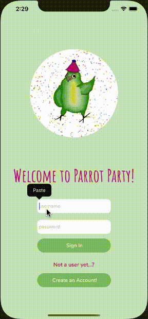

## Welcome to Parrot Party!



An iOS app for listing and adopting tropical birds around the UK for my Makers Academy final team project. Created by [@louballantyne](https://github.com/louballantyne), [@cspoppuppy](https://github.com/cspoppuppy) and myself over a 2 week period.

----

### ⁉️ Why Parrot Party

The motivation for this project was to automate and streamline the current process of rehoming tropical birds as much as possible. As it is all done by charities and volunteers, the current clunky process of emailing and making phonecalls takes a lot of time. An app such as this could reduce this effort for charities. We also wanted our app to be visually pleasing and fun to use. For a full demo and presentation of the project is available [here](https://www.youtube.com/watch?v=avCYlOvstGc) (from 17min30s for 5 minutes)

----

### 🦜 What can you do on Parrot Party?

- There are two types of user for the app: a charity user with a bird to rehome or a bird lover looking to adopt a bird  

* If you are a **charity user** you can:
   - See the birds you have posted in a list
   - Post a bird for adoption: add a photo, bio and location
   - See your birds adoption applications and approve or reject them

* If you are a **bird lover** you can: 
   - View birds from a list with details
   - View birds by location (map view)
   - Apply to adopt a bird by completing short application form
   - Celebrate with a confetti animation when your adoption is approved!
   
----

### 💻 Workflow:

* Followed an **Agile** development process, applying XP values (Communication, Feedback, Courage, Respect, Simplicity)
* Ideas and planning session using a Miro board to collate all our ideas into themes and then voted to ensure fairness
* Created a Team Charter with team goals and our own personal goals for the project (what technologies did we want to learn, what processes did we want to practise)
* Decided on daily stand ups and retros, rotating the Leader and Scribe, to make sure we were communicating and giving feedback regularly
* Daily mood check ins - what sort of bird are you feeling today? Perhaps 🦉 🦆 🐥 🦅  but not the only options!
* Used a Trello board to break our user stories down into tickets to be assigned. It also held our resources (team charter, planned routes, helpful links for the tech stack etc)
* It was a 3 person team so rotated pair programming and working alone
* Came together to unblock

---- 

### 🛠  TechStack:

- MongoDB - document-oriented database program
- Express(.js) - Node.js web app framework
- React Native(.js) - a JavaScript library for user interfaces
- Node(.js) - a cross-platform JavaScript run-time environment 

* Packages:

   - Multer/Multer-S3: for uploading images to Amazon buckets
   - AWS-SDK: Needed for interacting with AWS in JavaScript
   - UUID: Creating unique path for image upload
   - Express-Sessions: Starting a session
   - BCyrpt: Hashing passwords for secure storage in the database
   - Mongoose: an ORM to interact with the database
   - Connect-Mongodb-session: To store session data in a database

* External APIs:
   - [MapQuest Api](https://developer.mapquest.com/): Returns the geocodes (then extract latitude and longitude) given a specified location
   - [Amazon S3 Buckets](https://aws.amazon.com/s3/): To store images

- Server: [Backend repo](https://github.com/fg24davies/party-parrots-server) 

##### 🏃🏼‍♀️ How to run the app

* Install Xcode if not already installed (for the iOS simulator)
* Clone this repository
* Run ``` npm install ```
* Run ``` expo start ```

The [server](https://parrot-party-api.herokuapp.com/) is hosted on Heroku and does not need to be run locally.

----
### ✏️ Some things that would be nice to add

- [] Deleting birds after a complete application
- [] Testing! - There is minimal testing in the app and I would like to learn how to test better in React Native (end to end with Cypress/Detox)

---- 

### 🕵🏼 What I learnt from this project

* I can store information securely in a database and understand how
   - BCyrpt library ```.hash``` method auto generates a salt which is added to the inputted password. This is then hashed and the hashed password stored in the database.
   - Number of salt rounds (the time needed by BCrypt to hash a password) is set to 10 - a compromise between how long the user has to wait to log in and security
   
* I can fetch data from external APIs or store data in external APIs! 
   - Using AJAX requests to communicate with external APIs such as the MapQuest and communicate with our server

* Sessions and Authentication are complicated!
   - We were able to store session data in a MongoDB collection but not used in the way we intended
   - Use something like Auth0 to deal with security 
   
* An Intro to React
   - There was a steep learning curve, took time for individual study and came back to together to knowledge share
   - Explored React Native libraries such as confetti for UX and React Navigation to pass parameters to different screens and access them through destructuring

    
----

### 🌍 Useful links from the www

- Node/Mongo/Express tutorials:
   - https://www.youtube.com/watch?v=qj2oDkvc4dQ&ab_channel=WebDevSimplified  
   - https://blog.logrocket.com/mern-stack-tutorial/

- Getting React front-end to talk to Node.js:
    - https://www.freecodecamp.org/news/how-to-create-a-react-app-with-a-node-backend-the-complete-guide/
    
- Testing a database connection with SuperTest
   - https://medium.com/codechef-vit/integration-testing-for-express-mongoose-app-44390d29bb2
   
- Deploying a server on Heroku 
   - https://devcenter.heroku.com/articles/getting-started-with-ruby#prepare-the-app

---- 


**Credit** to [@louballantyne](https://github.com/louballantyne) for time and effort in working with Birdline to rehome birds across the UK (and for the very fun project idea!) and credit to [@cspoppuppy](https://github.com/cspoppuppy) for sharing so much knowledge!


